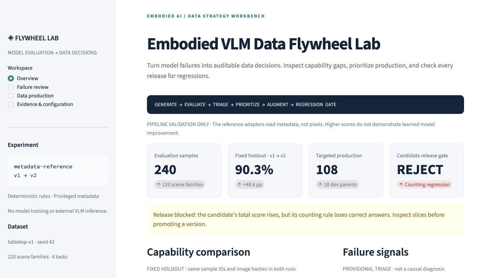
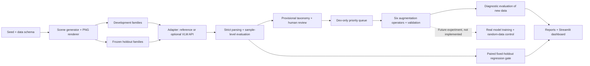
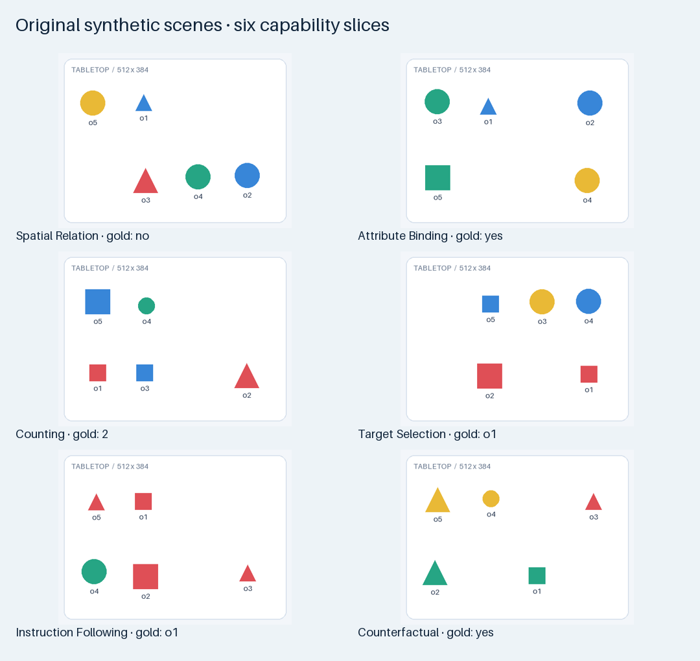
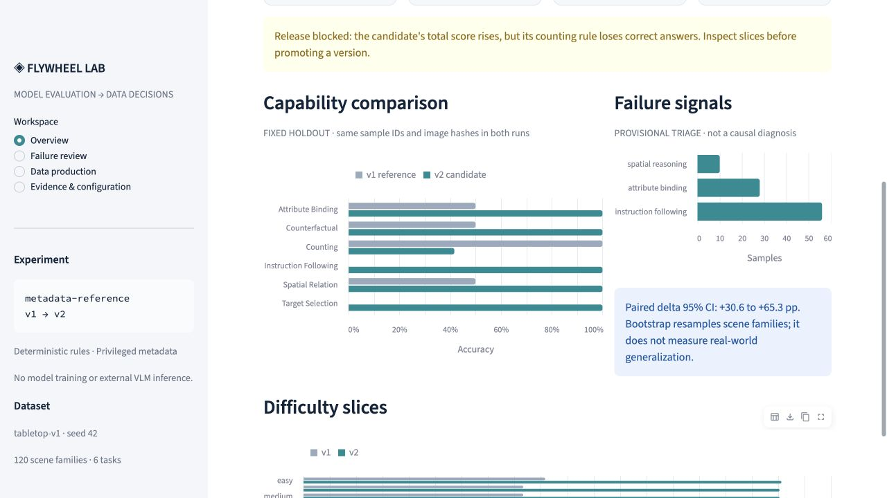

# Embodied VLM Data Flywheel Lab


> **新增：视觉贡献干预 v3（无训练）。** 90题/30场景族、270次真实CPU生成。保留集任务宏平均：真实54.7%、空白40.0%、错配25.3%；贡献主要来自空间题，计数与存在能力仍有限。[实际报告](docs/GROUNDING_V3_REPORT.md) · [冻结协议与复现](docs/GROUNDING_V3_PROTOCOL.md) · [面试验收](docs/GROUNDING_V3_INTERVIEW.md)。旧规则与第一轮推理证据原样保留。
**Turn evaluation failures into an auditable data-production plan—and reject regressions before release.**

A small, reproducible workbench for data-loop engineering: synthetic tabletop images → evaluation → failure triage → data prioritization → targeted augmentation → fixed-set regression. Built to demonstrate how model, data and product decisions connect.

[中文入口](README.zh-CN.md) · [Actual experiment report](docs/EXPERIMENT_REPORT.md) · [Data strategy](docs/DATA_STRATEGY.md) · [Interview guide](docs/INTERVIEW_GUIDE.md)

> **Two separate evidence tracks:** the original metadata-privileged rule demo is retained unchanged. A new **real local SmolVLM-256M** experiment uses image + question only, frozen scene-family splits and paired prompts. **Neither experiment trains a model.**

## Real VLM upgrade · 真实桌面视觉实验

72 questions / 24 new scene families · 36 dev + 36 holdout · 144 actual CPU generations. Tasks: color counting, attribute existence and spatial relations. **Holdout: 61.1% → 61.1%; no improvement. A dev-majority answer prior also scores 61.1%, limiting grounding claims.** Independent `.venv-vlm`; fixed public weights; all raw failures retained. Development failures alone produce traceable translation variants, with no claim of training gains.

[中文说明](README.zh-CN.md) · [真实实验报告](docs/REAL_VLM_EXPERIMENT.md) · [模型卡](docs/REAL_VLM_MODEL_CARD.md) · [复现](docs/REAL_VLM_REPRODUCE.md) · [泄漏审计](docs/REAL_VLM_DATA_AUDIT.md) · [面试](docs/REAL_VLM_INTERVIEW.md)

The sections below describe the **historical rule track**. Its 41.7% → 90.3% score and REJECT decision remain workflow evidence, never neural training gains.



**Evidence at a glance:** 240 original samples / 120 scene families · 6 task types · 18 selected dev parents · 108 generated augmentations. The candidate's fixed-holdout accuracy rises from **41.7% to 90.3%**, yet the gate **REJECTS** it because counting falls from **100% to 41.7%**. This is a predesigned rule-regression demonstration, not a training result. See [machine-readable evidence](reports/demo/summary.json).

## 1. Project Overview

A Python/Pillow/Streamlit lab with typed adapter interfaces, JSONL evidence, paired synthetic scenes, explicit data contracts and inspectable product tradeoffs. Default execution needs no API key, GPU, database or cloud service. The optional API adapter sends only image + question to a user-configured compatible vision endpoint.

## 2. Why This Project

A training-strategy PM must translate “the model selected the wrong object” into a measurable capability, plausible failure hypotheses, a budgeted data plan and an independent release decision. A single aggregate score or chat UI cannot establish that chain. This project makes each intermediate decision reviewable and testable.

It is relevant to embodied perception and instruction understanding, but does not claim robot execution, real physics or world-model training.

## 3. System Architecture



`src/flywheel/`: `data.py` generation/oracle/validation; `adapters.py` model contract; `evaluation.py` parser/metrics/triage/regression; `strategy.py` queue; `augmentation.py` production; `pipeline.py` orchestration; `cli.py` commands.

## 4. Data Flywheel

1. Generate original data and freeze scene-family splits before inference.
2. Run v1, retain every output/error, and compute stratified metrics.
3. Classify symptoms provisionally; export a human review queue.
4. Mine **dev only**, score production value/cost and enforce diversity caps.
5. Produce counterfactual, hard-negative, curriculum, attribute, position and distractor variants; recompute gold labels and deduplicate.
6. Run the predeclared v2 rule comparison on exactly the same original samples; evaluate augmented data as a separate diagnostic slice.
7. Reject if any task slice declines beyond the configured tolerance. No training consumes the generated data in this demo.

## 5. Dataset Schema

Every sample includes `sample_id`, `image_path`, `question`, `ground_truth`, `task_type`, `difficulty`, `scene_metadata`, `data_source`, `generator_version`, `split` and `tags`. Additional fields preserve scene-family/parent lineage, dataset version, image hash, structured query and validation-derived annotation confidence.

Task types: spatial relation, attribute binding, counting, target selection, multi-condition instruction following and counterfactual existence. IDs are printed beneath objects; answers are yes/no, an integer or a sorted object-ID set. [Data Card](docs/DATA_CARD.md) defines coordinates, sizes, adjacency, splits and biases; [JSON schema](schemas/sample.schema.json) is executable.



## 6. Evaluation Metrics

Exact match and normalized accuracy; task/difficulty/split/tag slices; system/refusal error rate; unparseable rate; actual median/p95 latency; optional token/cost fields; 95% scene-family bootstrap intervals; paired version deltas and regressed/fixed IDs. Errors remain in the accuracy denominator. Missing cost is null, not free. The short-answer oracle does not need LLM-as-a-Judge.

[Evaluation Card](docs/EVALUATION_CARD.md) explains denominators, clustering, leakage, cache effects and the distinction between a descriptive guardrail and a significance test.

## 7. Failure Taxonomy

Eleven categories cover perception, spatial reasoning, attribute binding, counting, instruction following, distractors, output format, refusal, system/API error, ambiguity and annotation. Automatic semantic labels are **task-based hypotheses**, not proven root causes. Human review can change categories and production eligibility without silently changing gold labels or accuracy. [Definitions, examples and review commands](docs/FAILURE_TAXONOMY.md).

## 8. Data Prioritization

`priority = annotation_quality × weighted(failure_frequency, task_importance, severity, novelty, regression) / production_cost_proxy`

Weights, costs and budget live in [configs/demo.json](configs/demo.json). Every scored row saves its factor breakdown. Default budget: 18 parents, at most two per coarse signature and one per scene family. Infrastructure/format/refusal and data-quality issues are routed out of automatic augmentation. [Formula, assumptions and limits](docs/DATA_STRATEGY.md).

## 9. Quick Start

Tested on **Python 3.14** with the exact versions in `requirements-lock.txt` (macOS locally; Linux CI status linked below). Core package metadata allows Python 3.11+, but that broader environment matrix has not been verified. Use Python 3.14 for the pinned recipe. Installation requires internet; after installation, the core demo is offline. Run from the repository root.

```bash
python3 -m venv .venv
source .venv/bin/activate
python -m pip install -c requirements-lock.txt -e '.[dashboard,dev]'
flywheel demo --config configs/demo.json --data-dir data/sample --report-dir reports/demo
pytest -q
streamlit run dashboard.py
```

Open [the local dashboard](http://127.0.0.1:8501). On a typical laptop the actual demo runs in seconds; dependency download time varies. All sample data and reports are already committed so reviewers can inspect them without execution.

Individual stages / custom experiments:

```bash
flywheel generate --data-dir data/generated
flywheel validate --data-dir data/generated
flywheel infer --data-dir data/generated --version v1 --outputs reports/local/outputs.jsonl
flywheel evaluate --data-dir data/generated --outputs reports/local/outputs.jsonl --report-dir reports/local/evaluation
flywheel prioritize --old-scores reports/demo/v1_scores.jsonl --report-dir reports/local/strategy
flywheel compare --old-scores reports/demo/v1_scores.jsonl --new-scores reports/demo/v2_scores.jsonl --report-dir reports/local/comparison
python scripts/check_reproducibility.py
python scripts/qa.py
```

The default `compare` example uses all original samples; the demo's separate `holdout_regression` drives the holdout decision. To add a real model, see the [optional API adapter](docs/API_ADAPTER.md). Those API commands are not part of the offline recipe and have not been run against a provider.

## 10. Example Results

Actual **fixed holdout**: 72 samples, 36 families, 12 samples per task.

| Capability | v1 reference | v2 candidate | Delta |
|---|---:|---:|---:|
| Spatial relation | 50.0% | 100.0% | +50.0 pp |
| Attribute binding | 50.0% | 100.0% | +50.0 pp |
| Counting | 100.0% | 41.7% | **−58.3 pp** |
| Target selection | 0.0% | 100.0% | +100.0 pp |
| Instruction following | 0.0% | 100.0% | +100.0 pp |
| Counterfactual | 50.0% | 100.0% | +50.0 pp |
| **Overall** | **41.7%** | **90.3%** | **+48.6 pp** |

Paired delta CI: **[+30.6, +65.3] pp** from 1,000 scene-family bootstrap replicates. **Decision: REJECT** due to counting. Both versions use privileged metadata and deliberate rule limitations. No inference about real VLM accuracy or training gains is justified.

Trace each number through [summary.json](reports/demo/summary.json), [v1 scores](reports/demo/v1_scores.jsonl), [v2 scores](reports/demo/v2_scores.jsonl), [priority queue](reports/demo/priority_queue.jsonl), [configuration](configs/demo.json) and [experiment report](docs/EXPERIMENT_REPORT.md).

## 11. Dashboard

Four workspaces: Overview (capability/difficulty comparison and gate), Failure review (image, question, gold, prediction, trace), Data production (scored queue, before/after mix, parent/augmentation inspection), Evidence & configuration (versions, validation, metrics, downloadable report). Uses actual saved artifacts; no mock UI numbers. [Screenshot](assets/dashboard.png) was captured from the running local Streamlit app.



## 12. Reproducibility

Seed 42; versioned generator, prompt and config; canonical content hashes; image hashes; environment receipt; isolated local Git history. `check_reproducibility.py` rebuilds base and augmented datasets and checks every decoded RGB pixel, metadata field, label, output, stable metric, queue and report. Both committed and regenerated file hashes must match their actual PNG bytes. macOS zlib-ng and Linux zlib can encode identical pixels differently; only after full pixel equality does the comparison align their derived identity hashes. Stored evidence is never rewritten. Actual timestamps and latency are excluded. Use `python scripts/check_reproducibility.py --strict-bytes` to additionally require identical PNG bytes in the same codec environment.

`reports/demo/artifact_manifest.json` hashes run artifacts. [Local QA receipt](reports/qa.json) records executed checks. `.github/workflows/ci.yml` configures install, lint, reproducibility, demo, tests and artifact upload. Published at [https://github.com/kimzclandi/vlm-data-flywheel-lab](https://github.com/kimzclandi/vlm-data-flywheel-lab). Remote HEAD and key artifacts have been verified, including anonymous README access. See [live Actions status](https://github.com/kimzclandi/vlm-data-flywheel-lab/actions) and [publication verification](reports/PUBLICATION.md). [Publication instructions](docs/PUBLISHING.md) include exact-HEAD and anonymous public-content verification.

## 13. Safety and Privacy

Original generated data only. No people, private files, company/school content, credentials or machine-specific paths in published artifacts. Image paths are relative and validated. Environment secrets and API caches/local runs are ignored. API errors do not store headers, URLs or sensitive response bodies. Privacy scanning supplements manual review; it is not a security certification. See [SECURITY.md](SECURITY.md).

## 14. Limitations

Simple 2D clean shapes, visible IDs, templated language and shared generator distribution; no occlusion, real perception, robot control, physics or world model. Difficulty/novelty/cost are proxies. Small, public holdout cannot establish real-world generalization. The historical track has no real VLM run. Across both tracks, no training, human causal-label calibration, supplier execution or online impact is claimed. Deliberate rule improvements are not data-learning effects. API compatibility requires testing against the chosen provider.

## 15. Roadmap

Delivered separately above: a pixels-only real-VLM baseline and frozen prompt comparison. Next: equal-budget targeted-vs-random data fine-tuning with multiple seeds. Later: lawful real camera scenes, independent annotations, calibration, group-aware OOD splits and embodied task-success checks. These are planned experiments, not delivered results.

## 16. Interview Talking Points

Start with the rejected candidate, not its aggregate score. Explain why data selection and release evaluation use different splits; why a wrong answer does not establish a root cause; and how score weights connect product risk to limited data-production capacity. Be explicit about AI-assisted implementation and the absence of actual neural training. [Chinese interview guide](docs/INTERVIEW_GUIDE.md) includes 30-second/2-minute introductions, STAR, ten follow-ups and active-recall practice.

[Product Brief](docs/PRODUCT_BRIEF.md) · [Data Strategy](docs/DATA_STRATEGY.md) · [Data Card](docs/DATA_CARD.md) · [Evaluation Card](docs/EVALUATION_CARD.md) · [Failure Taxonomy](docs/FAILURE_TAXONOMY.md) · [Project Management / RACI](docs/PROJECT_MANAGEMENT.md)

## 17. License

Code: [MIT](LICENSE). Original generated data/images: [CC0-1.0](data/LICENSE). Other dependencies retain their own licenses. [Contributing](CONTRIBUTING.md).
