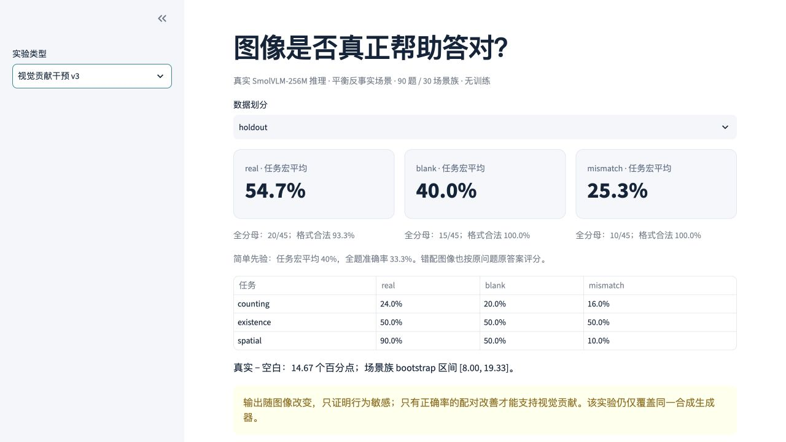

# Visual-input interventions in a small VLM

[](https://github.com/kimzclandi/vlm-data-flywheel-lab/actions/workflows/ci.yml)

[中文介绍与运行](README.zh-CN.md)

Does a correct answer depend on the image? This personal research project compares original, blank and mismatched images using a fixed SmolVLM-256M model on controlled synthetic counting, existence and spatial-relation questions. **Inference was actually run; no model was trained or fine-tuned.** The `real` arm means the original synthetic image, not a camera-captured scene.

The repository implements scene generation, a pixels-and-question adapter, paired interventions, scoring that retains failures, and a results viewer. Development and holdout examples are separated by scene family.

## Current results

90 questions from 30 scene families, with 270 CPU generations across three input conditions. The holdout contains 45 questions from 15 families: 25 counting, 10 existence and 10 spatial questions. All-question accuracy and equal-weight task-macro accuracy therefore have different denominators.

| Image input | All-question holdout accuracy | Three-task macro accuracy |
|---|---:|---:|
| Original (`real`) | 20/45 = 44.4% | 54.7% |
| Blank | 15/45 = 33.3% | 40.0% |
| Mismatched | 10/45 = 22.2% | 25.3% |

Original minus blank task-macro accuracy is +14.67 percentage points, with a paired scene-family bootstrap 95% interval of [+8.00, +19.33]. The contribution mainly comes from spatial questions (90% versus 50%); existence stays at 50%, and original-image counting accuracy is 24%. This supports limited visual-input contribution in this synthetic setting, not general grounding, robot capability or training gains. Invalid answers remain in the denominator.

[Experiment report (Chinese)](docs/GROUNDING_V3_REPORT.md) · [Frozen protocol](docs/GROUNDING_V3_PROTOCOL.md) · [Raw generations and metrics](reports/grounding_v3/)

## View and reproduce

Run from the repository root in a separate environment; preserve any existing environment. Installation needs network access. Verification and browsing use saved generations and require no model download or inference.

```bash
python3 -m venv .venv
source .venv/bin/activate
python -m pip install -c requirements-lock.txt -e '.[dashboard,dev]'
python scripts/verify_grounding.py
streamlit run dashboard.py --server.address 127.0.0.1
```

The Dashboard opens **「视觉贡献干预 v3」** by default. The verification script checks the 270 saved generations, denominators, pairing and metrics. [Running guide](docs/RUNNING.md) separates this replay from actual inference with fixed weights in a separate Python 3.12 environment. The historical `flywheel demo` command runs metadata rules, not this model experiment.



The screenshot shows this saved experiment, not a new inference or training run.

## Implementation and attribution

Repository work includes [interventions and scoring](src/flywheel/grounding.py), the [model input adapter](src/flywheel/local_vlm.py), family isolation and immutable records. SmolVLM and its pretrained weights come from Hugging Face; execution uses PyTorch and Transformers. Code, tests and documentation were developed with AI assistance.

[Research history and optional materials](docs/RESEARCH_INDEX.md) separate the earlier prompt comparison, metadata-rule prototype, and method/design attachments. The historical rule score change of 41.7%→90.3% is not a learning gain; the candidate was **REJECTED** for a counting regression. Original records remain available.

## Limitations

Clean 2D shapes, fixed colors and sizes, and a shared generator constrain the result. Each task has only five holdout families. Fixed-size objects permit shortcuts such as color area. No real-camera, OOD, robot or training benefit has been established. Sensitivity to an image does not by itself show correct understanding.

Code: [MIT](LICENSE). Original data/images: [CC0-1.0](data/LICENSE). The model retains its upstream license. [Contributing](CONTRIBUTING.md).

[2026-09-19 工程维护与验证边界](docs/maintenance/2026-09-19/README.md)
