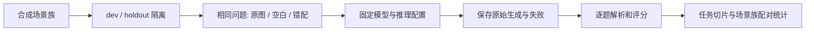

# 如何阅读与复核视觉输入评测

## 问题与实验单位

本实验检验固定模型的回答是否依赖视觉输入。输入是合成图像和问题，输出是原始生成、解析结果、逐题得分及分任务统计。实验单位不是一张独立图片：同一场景族产生关联问题，三个输入条件也共享问题。因此使用配对比较，并在场景族层面 bootstrap，而不是把 270 条生成当作独立样本。

## 三种输入分别回答什么

| 输入 | 保持不变 | 改变 | 解读 |
|---|---|---|---|
| `real` | 问题、固定模型、评分规则 | 使用问题对应的原合成图 | 基准条件；real 不表示真实相机 |
| `blank` | 同上 | 图像替换为空白 | 检查缺少视觉内容时的回答 |
| `mismatch` | 同上 | 使用错配图像 | 检查视觉内容与问题不匹配时的回答 |

原图优于干预图只支持当前数据上的输入贡献。若模型利用颜色面积等捷径，仍可能得到正确答案；不能将分数差直接解释为通用视觉理解。

## 从一条记录追到汇总

1. 阅读[冻结协议](GROUNDING_V3_PROTOCOL.md)，确认模型、场景族切分与评分约定。
2. 在[保存记录目录](../reports/grounding_v3/)查找同一问题的三个条件，先看原始输出，再看解析和得分。
3. 对照[评分实现](../src/flywheel/grounding.py)中的 `score` 和 `summarize`。格式失败保留在分母，不能先过滤失败再算准确率。
4. 对照[结果报告](GROUNDING_V3_REPORT.md)核查任务分母：holdout 共 45 题，计数 25、存在性 10、空间关系 10。宏平均对三类等权，和全部题目的准确率不同。
5. 阅读任务切片后再读总体差异：当前原图优势主要在空间关系，不能写成三类任务均获提升。

## 运行层次与产物

| 目的 | 入口 | 需要模型 | 实际验证 |
|---|---|---|---|
| 核对已保存结果 | `python scripts/verify_grounding.py` | 否 | 270 条生成的配对、分母和指标 |
| 浏览逐条结果 | `streamlit run dashboard.py` | 否 | 浏览保存记录，不执行新推理 |
| 当前代码的一次真实推理 | `scripts/smoke_local_vlm.py` | 是，固定本地快照 | 一张 dev 图的执行链路，输出到新目录 |
| 重跑历史完整实验 | 按运行说明使用冻结 checkout | 是 | 历史协议约束下的生成，不可用当前源码绕过哈希 |

安装、完整参数和输出保护见[运行说明](RUNNING.md)。`flywheel demo` 是历史 metadata 规则演示，不能用于重现本实验的神经模型输出。

## 常见失败与处理

- 模型或源码哈希不符：检查是否使用了对应冻结版本；不要修改协议来接受差异。
- 输出目录已存在：保留记录，换一个新的 `work/` 输出目录。
- 分数与表格不同：先区分 dev/holdout、全题准确率/任务宏平均，以及原图/空白/错配条件。
- 单次 smoke 成功：只能证明该次执行成功，不能宣称重跑了 270 条或获得新质量收益。

新任务、真实相机数据或新模型属于新实验，应建立新的协议和独立评估，不继续用已查看的 holdout 挑参数。
